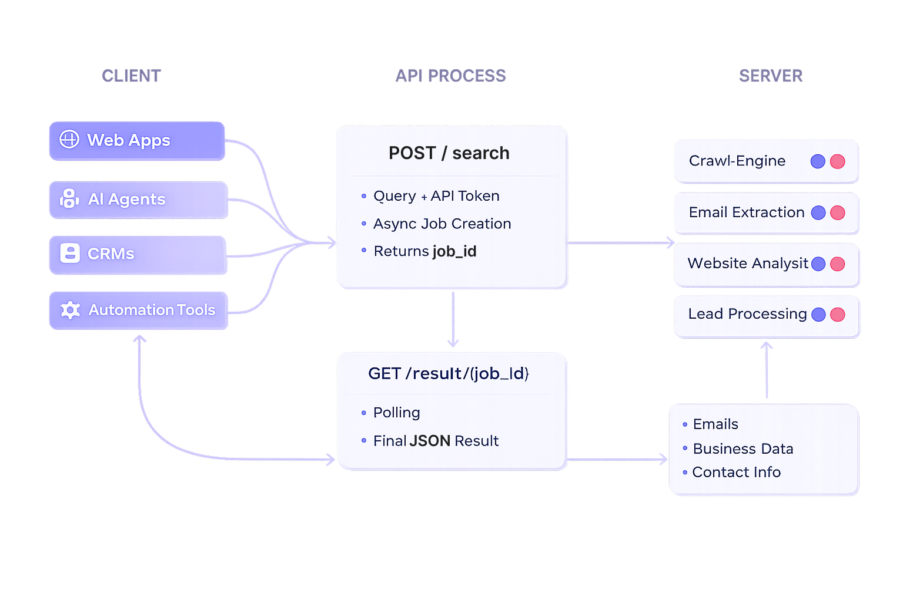

# Getting Started

### :material-book-open-page-variant: Introduction
---

Welcome to the official documentation for the FindMyClient API.

The API is built for asynchronous search processing. Each search request is queued as a background job and returns a unique `job_id`. You can retrieve results by polling the result endpoint until the job status is marked as `completed`.

Both **GET** and **POST** methods are supported for flexible integration with applications, scripts, AI agents, and automation workflows.

<br>

!!! info "Async Processing"

    Search requests are processed in the background to support scalable business discovery and large web data operations.

<br>

### :material-source-branch: Workflow Overview
---

The API follows a simple asynchronous workflow.



### :material-numeric-1-circle: Submit Request
=== "<span style='color: #6d82f6;'>:octicons-tag-24: 0.0.1</span>"

Call the `/search` endpoint to create a new background search job.

```http
POST /search
```

<br>

### :material-numeric-2-circle: Receive Job ID
=== "<span style='color: #6d82f6;'>:octicons-tag-24: 0.0.6</span>"

The API immediately returns a unique `job_id`.

```json
{
  "job_id": "654e0e93-1a14-44d3-97e1-d7fabaf782fd",
  "status": "processing"
}
```

<br>

### :material-numeric-3-circle: Check Status
=== "<span style='color: #6d82f6;'>:octicons-tag-24: 0.0.6</span>"

Poll the result endpoint periodically to monitor progress.

```http
GET /result/<job_id>
```

Example:

```http
GET /result/654e0e93-1a14-44d3-97e1-d7fabaf782fd
```
<br>

### :material-numeric-4-circle: Completion
=== "<span style='color: #6d82f6;'>:octicons-tag-24: 0.0.6</span>"

Once the status becomes `completed`, retrieve the final search results.

```json
{
  "status": "completed",
  "result": {
    "emails": []
  }
}
```
<br>

### :material-robot-outline: Designed For
---

FindMyClient is designed for:

| Use Case                         | Primary Users                   | Purpose                                                                        | Example                                                                 |
| -------------------------------- | ------------------------------- | ------------------------------------------------------------------------------ | ----------------------------------------------------------------------- |
| AI Agents                        | AI Developers, SaaS Builders    | Allow AI agents to autonomously discover and qualify prospects.                | An AI sales assistant finds local businesses matching a target profile. |
| CRM Enrichment                   | Sales Teams, CRM Administrators | Enhance existing CRM records with additional business and contact information. | Enrich company records before launching an outreach campaign.           |
| Internal Lead Generation Systems | Organizations, Growth Teams     | Power proprietary lead generation platforms with fresh prospect data.          | A company builds its own lead dashboard using FindMyClient APIs.        |
| Workflow Automation              | Operations Teams, Agencies      | Automate lead discovery and data processing tasks.                             | Automatically send newly discovered leads to a CRM or database.         |
| n8n Pipelines                    | Automation Builders             | Integrate lead generation into no-code and low-code workflows.                 | Trigger lead searches and route results to Google Sheets or Slack.      |
| Business Intelligence Tools      | Analysts, Researchers           | Use business data for reporting, market analysis, and decision-making.         | Analyze business density and market opportunities in a region.          |
| Developer Integrations           | Software Developers             | Embed lead generation and enrichment capabilities into applications.           | Build a custom prospecting platform using the FindMyClient API.         |


<br><br><br><br><br><br><br><br><br><br>