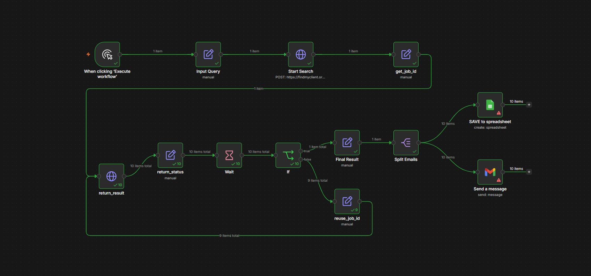
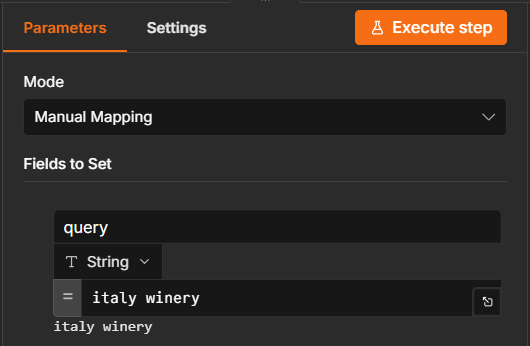
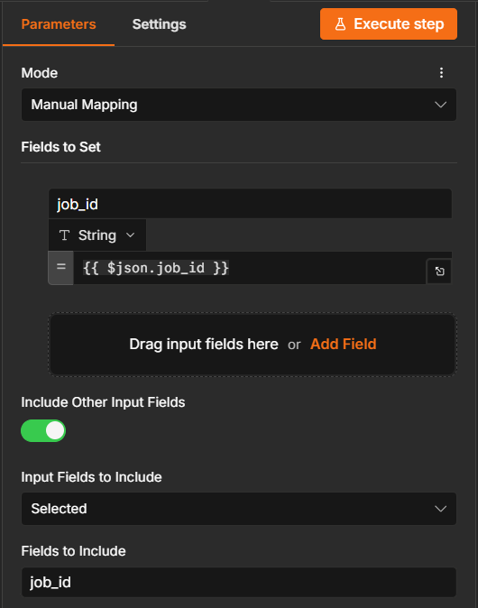

# Integration

### :material-connection: n8n Integration
---

Connect [FindMyClient.org](https://findmyclient.org) with n8n using the built-in HTTP Request node.

This integration is lightweight, flexible, and does not require a custom n8n community node. Since the FindMyClient API is REST-based, n8n can interact with it directly using standard HTTP requests.

<br>

### :material-sitemap: Workflow Overview
=== "<span style='color: #6d82f6;'>:octicons-tag-24: 0.0.6</span>"



The workflow:

1. Accepts a search query.
2. Starts a FindMyClient search job.
3. Retrieves the generated `job_id`.
4. Polls the API until the search is completed.
5. Extracts discovered emails.
6. Splits emails into individual records.
7. Optionally:
   - Save results to Google Sheets
   - Send emails via Gmail

<br>

!!! tip "Download n8n Workflow"

    Get the latest automation workflow below.

    <a href="https://storage.googleapis.com/findmyclient-downloads/n8n_workflow_v1.2.json" class="md-button md-button--primary" download>
        ⬇ Download n8n_workflow_v1.2.json
    </a>

    If the download doesn’t start, right-click the button and select **“Save link as…”**.

<br>

### :material-cog: Prerequisites
=== "<span style='color: #6d82f6;'>:octicons-tag-24: 0.0.6</span>"

Before using this workflow:

- n8n installed
- FindMyClient API token
- Optional Google Sheets credentials
- Optional Gmail credentials


### :material-numeric-1-circle: Configure Search Query
=== "<span style='color: #6d82f6;'>:octicons-tag-24: 0.0.6</span>"

Add a **Edit Fields (Set)** node and input the search keyword.



### :material-numeric-2-circle: Start Search Job
=== "<span style='color: #6d82f6;'>:octicons-tag-24: 0.0.6</span>"

Add a **HTTP Requests** node and set the parameters.


**Method**
```http
POST
```

`URL`
```http
https://findmyclient.org/api/search
```

**Headers**

`Name`
```json
{
  "token"
}
```
`Value`
```json
{
  "YOUR-API-TOKEN"
}
```
`Name`
```json
{
  "content-type"
}
```
`Value`
```json
{
  "application/json"
}
```
**Body Parameters**

`Name`
```json
{
  "query"
}
```
`Value`
```json
{
  "{{ $json.query }}"
}
```

### :material-numeric-3-circle: Store Job ID
=== "<span style='color: #6d82f6;'>:octicons-tag-24: 0.0.6</span>"

Add a **Edit Fields (Set)** to store `job_id`.



This ID is used for polling search progress.


### :material-numeric-4-circle: Poll Search Status
=== "<span style='color: #6d82f6;'>:octicons-tag-24: 0.0.6</span>"

Add a **HTTP Requests** node and set the parameters.

**Method**
```http
GET
```

`URL`
```http
https://findmyclient.org/api/result/{{$json["job_id"]}}
```

Returned responses:

#### Processing

```json
{
  "status": "processing"
}
```

#### Completed

```json
{
  "status": "completed",
  "result": {
    "output": {
      "emails": [
        "info@example.com",
        "sales@example.com"
      ]
    }
  }
}
```

### :material-numeric-5-circle: Wait and Retry
=== "<span style='color: #6d82f6;'>:octicons-tag-24: 0.0.6</span>"

use **Wait** node and set the parameters.

If the status is not:

```json
completed
```

The workflow:

1. Waits 30 seconds
2. Reuses the existing `job_id`
3. Checks the API again

This creates a polling loop until the search finishes.


### :material-numeric-6-circle: Extract Results
=== "<span style='color: #6d82f6;'>:octicons-tag-24: 0.0.6</span>"

When completed:

```json
{
  "result": {
    "output": {
      "emails": [
        "info@example.com",
        "sales@example.com",
        "contact@example.com"
      ]
    }
  }
}
```

The workflow stores:

```json
{
  "result.output.emails": [...]
}
```

### :material-numeric-7-circle: Split Emails
=== "<span style='color: #6d82f6;'>:octicons-tag-24: 0.0.6</span>"

The **Split Emails** node converts:

```json
[
  "info@example.com",
  "sales@example.com",
  "contact@example.com"
]
```

Into:

```json
{
  "email": "info@example.com"
}
```

```json
{
  "email": "sales@example.com"
}
```

```json
{
  "email": "contact@example.com"
}
```

This allows downstream processing of each email individually.

### Optional: Save to Google Sheets
---

The workflow includes a disabled Google Sheets node.

Example spreadsheet:

| Email |
|---------|
| info@example.com |
| sales@example.com |
| contact@example.com |

Enable the node and configure your spreadsheet credentials.

### Optional: Send Email Notifications
---

The workflow includes a disabled Gmail node.

Possible use cases:

- Notify sales teams
- Send discovered leads
- Trigger CRM imports
- Alert automation systems

Enable the Gmail node and configure OAuth credentials.


### API Endpoints Used
=== "<span style='color: #6d82f6;'>:octicons-tag-24: 0.0.6</span>"

#### Start Search

```http
POST /api/search
```

Request:

```json
{
  "query": "italy winery"
}
```

Response:

```json
{
  "job_id": "abc123"
}
```

=== "<span style='color: #6d82f6;'>:octicons-tag-24: 0.0.6</span>"

#### Get Results

```http
GET /api/result/{job_id}
```

Response:

```json
{
  "status": "completed",
  "result": {
    "output": {
      "emails": []
    }
  }
}
```

=== "<span style='color: #6d82f6;'>:octicons-tag-24: 0.0.6</span>"

### Customization Ideas

#### Dynamic Queries

Replace the Set node with:

- Webhook Trigger
- Form Submission
- Google Sheets Input
- Airtable Input

Example:

```json
{
  "query": "singapore cafe"
}
```

---

### CRM Integration

After `Split Emails`, connect to:

- HubSpot
- Salesforce
- Pipedrive
- Zoho CRM

---

### Lead Enrichment

After collecting emails, enrich contacts using:

- Apollo
- Clearbit
- Clay
- Custom APIs

---

#### Error Handling

Common scenarios:

| Scenario | Action |
|-----------|----------|
| Search still processing | Wait and retry |
| Empty result set | End workflow |
| Invalid API token | Update credentials |
| API timeout | Retry request |
| Network failure | Use n8n retry logic |

=== "<span style='color: #6d82f6;'>:octicons-tag-24: 0.0.6</span>"

### Example End-to-End Flow

Input:

```json
{
  "query": "italy winery"
}
```

Output:

```json
[
  "info@winery1.com",
  "sales@winery2.com",
  "contact@winery3.com"
]
```

The workflow automatically handles:

- Job creation
- Polling
- Status checking
- Email extraction
- Record splitting
- Export and notification steps

making it suitable for automated lead generation pipelines.

<br><br><br><br><br><br><br><br><br><br>